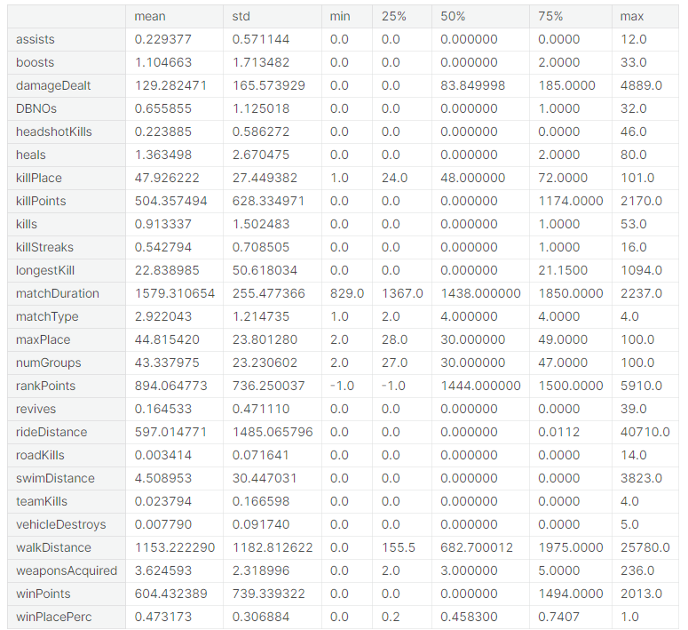

<!-- TOC -->

# 0. Problem Statement:
In a PUBG game, up to 100 players start in each match (matchId). Players can be on teams (groupId) which get ranked at the end of the game (winPlacePerc) based on how many other teams are still alive when they are eliminated. In game, players can pick up different ammunition, revive downed-but-not-out (knocked) teammates, drive vehicles, swim, run, shoot, and experience all of the consequences -- such as falling too far or running themselves over and eliminating themselves.

You are provided with a large number of anonymized PUBG game stats, formatted so that each row contains one player's post-game stats. The data comes from matches of all types: solos, duos, squads, and custom; there is no guarantee of there being 100 players per match, nor at most 4 players per group.

You must create a model which predicts players' finishing placement based on their final stats, on a scale from 1 (first place) to 0 (last place).

# 1. Data Preprocessing:
## 1.1  Load dataset:
The PUBG Dataset has up to 100 players in each match which are uniquely identified based on their matchId. The players can form a team in a match, for which they will have the same groupId and the same final placement in that particular match.

The data consists of different groupings, hence the data has variety of groups based on the number of members in the team(not more than 4) and matchType can be solo, duo, squad and customs.Also the matchType can be further more classified based on the perspective mode like TPP and FPP.

Approximately there are 3 million training data points and 1.3 million testing data points. There are in total 29 features. They are summarised as follows:

|Sr.No.|Feature|Type|Description|
| - | - | - | - |
|1|Id|Object|Unique Id for each Player.|
|2|matchId|Object|Id to identify matches.|
|3|groupId|Object|Id to identify the group.|
|4|assists|Int64|Number of enemy players this player damaged that were killed by teammates.|
|5|boosts|Int64|Number of boost items used.|
|6|damageDealt|Float64|Total damage dealt. Note: Self inflicted damage is subtracted.|
|7|DBNOs|Int64|Number of enemy players knocked.|
|8|headshotKills|Int64|Number of enemy players killed with headshots.|
|9|heals|Int64|Number of healing items used.|
|10|killPlace|Int64|Ranking in match of number of enemy players killed.|
|11|killPoints|Int64|Kills-based external ranking of player.|
|12|kills|Int64|Number of enemy players killed.|
|13|killStreaks|Int64|Max number of enemy players killed in a short amount of time.|
|14|longestKill|Float64|Longest distance between player and player killed at time of death. This may be misleading, as downing a player and driving away may lead to a large longestKill stat.|
|15|matchDuration|Int64|Duration of match in seconds.|
|16|maxPlace|Int64|Worst placement we have data for in the match.|
|17|numGroups|Int64|Number of groups we have data for in the match.|
|18|rankPoints|Int64|Elo-like ranking of players. |
|19|revives|Int64|Number of times this player revived teammates.|
|20|rideDistance|Float64|Total distance travelled in vehicles measured in metres.|
|21|roadKills|Int64|Number of kills while in a vehicle.|
|22|swimDistance|Float64|Total distance travelled by swimming measured in metres.|
|23|teamKills|Int64|Number of times this player killed a teammate.|
|24|vehicleDestroys|Int64|Number of vehicles destroyed.|
|25|walkDistance|Float64|Total distance travelled on foot measured in metres.|
|26|weaponsAcquired|Int64|Number of weapons picked up.|
|27|winPoints|Int64|Win-based external ranking of players.|
|28|matchType|Object|Identifies the matchType.|
|29|winPlacePerc|Float64|This is a percentile winning placement, where 1 corresponds to 1st place, and 0 corresponds to last place in the match.|
###
## 1.2  Data cleaning:
Data cleaning is the most important task
+ Resolve missing value
  
   The dataset had 1 missing value so I dropped it
+ Identify and eliminate noise data. 
  I will accept noisy data. Because the data set has too much noise, when it is too much, it is a feature of the data
+ Resolve conflicting data. 
  In general, the columns do not have any conflicts. The columns represent different information during the match so there will be no conflicts
## 1.3 Data integration:
+ Select only required data for the data mining process
  The ID column is not used so it will be dropped
  
+ Eliminate redundant and duplicate data
  
## 1.4 Data reduction:
+ Reducing Dataset Memory.
  Because pubg matches with more than 80 players are valid, I will remove matches with less than 80 players.
  
+ Convert type
  Because the data types of the columns are not consistent, I will reduce them to make the calculation faster
  
+ MatchType has many types I would like to change to number of players per team instead of fpp or tpp modes. *solo* = 1, *dou* = 2, *squad* = 4
  

### ***Dataset* Size after reduction:**

The EDA was quite interesting as the training dataset was about 3 million rows in size.The size of the training dataset was about **983.9 MB,** hence the task to handle it would have been somewhat difficult if it would have been involved in any computations.

So by looking at the datatypes of the columns, most of the types were float64 and int64, so we downcasted the datatype of all the numerical columns to as small as possible and reduced the size of the training dataset to **271.2 MB.**

|**Before**||
| - | - |
|**After**||		         

# 2. Exploratory Data Analysis:
## 2.1 Decription data:

## 2.2 Correlation between 'damageDealt' and "winPlacePerc":

Looking at the two charts above, we can see that the greater the amount of damage caused, the higher the rate of reaching top 1. similar to the columns not mentioned above, the histogram chart of those columns will be similar to the chart 'The damageDealt value with N = 10' in that it will focus almost all on the left
## 2.3 Correlation between 'killPlace' and "winPlacePerc":

In general, the higher the rankPoints, the higher the winPlacePerc except in some places perhaps due to the number of participants in the match or other factors.
## 2.4 Which type of match is more popular?:

In general, highly skilled players will prefer to play solo, while squad is more popular because it has a high team spirit.
## 2.5 Probability of being killed by headshot versus being killed while in a vehicle:

Looking at the chart, we can see that for every 4 people killed, 1 person was shot in the head, and the number of people killed in the car was very small because the car was driving at high speed so it was difficult for the player to be shot.
## 2.6 Comparison between RideDistance, swimDistance and walkDistance:

Looking at the chart, we can see that players prefer to ride and walk rather than swim because swimming is very likely to be shot to death

# 3. Train:
## 3.1 Reduce data:
Because there are some columns that are not important in training, I decided to drop those columns, and split data.

## 3.2 Create multiple layer perceptron(MLP) model
A Multilayer Perceptron (MLP) is a type of artificial neural network (ANN) consisting of multiple layers of interconnected perceptrons (or neurons). It's a feedforward neural network, which means that information flows in one direction, from the input layer through one or more hidden layers to the output layer. The model I use is designed to include 4 layers
+ Input layer has 25 neurons
+ Hidden layer 1 has 64 neurons with activation function 'relu'
+ Hidden layer 2 has 32 neurons with activation function 'relu'
+ Output layer has 1 neurons to predict the player's winPlacePerc

This is the general code I used to create the above MLP model

## 3.3 Create lightGBM model
I use LGBMRegressor in lightgbm library to predict regression results from lightGBM model. The hyperparameters for an LGBMRegressor model.
+ colsample_bytree:  Fraction of features to be randomly selected and used when building each tree. It helps prevent overfitting by introducing randomness into the model.
+ learning_rate:  This controls the step size at each iteration while moving toward a minimum of the loss function.
+ max_depth: Maximum depth of each tree.
+ min_split_gain: Minimum loss reduction required to make a further partition on a leaf node of the tree.
+ n_estimatorsn_estimators: The number of boosting rounds or trees to build.
+ num_leaves:  Maximum number of leaves for each tree.
+ reg_alpha: L1 and L2 regularization terms applied to the leaf weights. These terms help control overfitting by penalizing large weights.
+ subsample: Fraction of data to be randomly selected and used for training each tree. 
+ subsample_for_bin:  Number of data points to sample when creating histograms for finding the best splits.
+ n_jobs: The number of CPU cores to use during training. Setting it to -1 means using all available cores.
+ max_bin: Maximum number of discrete bins to bucket feature values in. This can affect the model's performance and memory usage.
+ num_iterations: The number of boosting iterations, which is set to 5100. This is similar to n_estimators but is used specifically for LightGBM.
+ min_data_in_bin: Minimum number of data points that should be in each bin.
This is the general code I used to create the above lightGBM

## 3.4 lightGBM model
**LightGBM** is a gradient-boosting framework based on decision trees to increase the efficiency of the model and reduces memory usage. 
It uses two novel techniques:
+ Gradient-based One Side Sampling(GOSS) 
+ Exclusive Feature Bundling (EFB)

**Gradient-based One Side Sampling Technique for LightGBM**
Different data instances have varied roles in the computation of information gain. The instances with larger gradients(i.e., under-trained instances) will contribute more to the information gain. GOSS keeps those instances with large gradients (e.g., larger than a predefined threshold, or among the top percentiles), and only randomly drops those instances with small gradients to retain the accuracy of information gain estimation. This treatment can lead to a more accurate gain estimation than uniformly random sampling, with the same target sampling rate, especially when the value of information gain has a large range. Usually, the retain ratio of large gradient data is 0.2 and the retain ratio of small gradient data is 0.1
**Exclusive Feature Bundling (EFB)**
High-dimensional data are usually very sparse which provides us the possibility of designing a nearly lossless approach to reduce the number of features. Specifically, in a sparse feature space, many features are mutually exclusive, i.e., they never take nonzero values simultaneously. The exclusive features can be safely bundled into a single feature (called an Exclusive Feature Bundle).  Hence, the complexity of histogram building changes from O(data × feature) to O(data × bundle), while bundle<feature. Hence, the speed of the training framework is improved without hurting accuracy. 
**Architecture of LightBGM**
LightGBM splits the tree leaf-wise as opposed to other boosting algorithms that grow tree level-wise. It chooses the leaf with the maximum delta loss to grow. Since the leaf is fixed, the leaf-wise algorithm has a lower loss compared to the level-wise algorithm. Leaf-wise tree growth might increase the complexity of the model and may lead to overfitting in small datasets.
Below is a diagrammatic representation of Leaf-Wise Tree Growth: 

## 3.5 Create linear regression
A linear regression is a model that assumes a linear relationship between inputs and the output.
Class Linear regression:
+ Task: to predict y from x by outputting y_pred = $h_w$(x) = $W^TX$
+ The train dataset $D_{train}$ denoted as (X,y) include N sample ${(x_1, y_1), (x_2, y_2), (x_3, y_3)...(x_n, y_n)}$, construct the matrix X and the vectors y and y_pred:
  - X.shape = (N, a) while a is number of features
  - y.shape = (N,)
  - $y_{pred}$ = (N,)
  - W.shape = (a,)
+ $MSE_{train} = \frac{1}{N} || y_pred-y ||^2 = \frac{1}{N}\sum_{n=1}^{N} (y_{pred-y})^2$
+ $∇_w(MSE_{Train}) = ∇_w(W^TX^TX_w - w^TX^Ty - y^TX_w + y^Ty) = 2X^TX_w - 2X^Ty$

$∇_w = 0$

$<=> 2X^TX_w - 2X^Ty = 0$

$<=> 2X^TX_w = 2X^Ty$

$<=> w = ((X^TX)^{-1}X^Ty)$

The ultimate goal is to find w from the above formula

## 3.6 Random Forest
The forest model is trained based on a combination of association rules (ensembling) and iterative sampling process (boostrapping). Specifically, this algorithm creates many decision trees where each decision tree is trained based on many different subsamples and the prediction result is voting from all decision trees. Thus, a forecast result is synthesized from many models so their results will not be biased. At the same time, combining forecast results from multiple models will have smaller variance than just one model. This helps the model overcome overfitting.
### 3.6.1 Ensemble model
Ensemble modeling is a machine learning technique that combines predictions from multiple individual models to produce a more accurate and robust final prediction. The idea behind the ensemble model is to take advantage of the diversity of different models to improve the overall prediction performance and reduce the risk of overfitting. In Random forest, those models are decision trees

### 3.6.2 Boostrapping
Bootstrapping is a statistical resampling technique used to estimate the sampling distribution of a statistic by repeatedly drawing samples (with replacement) from a single dataset. This method allows you to make inferences about population parameters, such as the mean, variance, or confidence intervals, even when you have a limited amount of data.
Assume the model training data is a set $D={(X_1,y_1), (X_2, y_2),...(X_n, y_n)}$ includes N observe. The tree forest algorithm will us reproducible sampling to form B child data set. This process of reproducible sampling is also called bagging.
### 3.6.3 Forest model
The forest model will apply both ensemble learning and booster sampling methods. The order of the process of creating a forest model is as follows:

1. Randomly resample from the training set to form a subset of the data.
2. variables and build a decision tree model based on these variables and the subset of data in step 1. We will build multiple decision trees so steps 1 and 2 will repeat many times.
3. Perform voting or averaging across decision trees to make a forecast.

This is the code that creates the above model:

# 4. Test:
## 4.1 Metric
The competition is evaluated through the "accuracy" metric with the loss function MSE(mean square error).

## 4.2 Results of the MLP model
The MLP model has quite poor results with an accuracy of 0.08684. Perhaps the MLP model is not suitable for regression problems or perhaps the architecture has not been designed properly.

## 4.3 Results of the lightGBM
The lightGBM model has much better results because this model is very good and popular on kaggle, with an accuracy of 0.05718.

## 4.4 Results of the linear regression
The results look good, but compared to lightGBM, they are still very low.

## 4.5 Results of the Random forest 
The results received are relatively good.

# Author section
+ Name: Nguyen Minh Quan, final year student of HCMUS 
+ Address: 20120554@student.hcmus.edu.vn or minhquannguyen20022002@gmail.com
# Reference
+ Dataset: [https://www.kaggle.com/competitions/pubg-finish-placement-prediction/overview](https://www.kaggle.com/competitions/pubg-finish-placement-prediction/overview)
+ LightGBM: [https://lightgbm.readthedocs.io/en/latest/index.html](https://lightgbm.readthedocs.io/en/latest/index.html)
+ RandomForest: [https://machinelearningcoban.com/tabml_book/ch_model/random_forest.html](https://machinelearningcoban.com/tabml_book/ch_model/random_forest.html)
